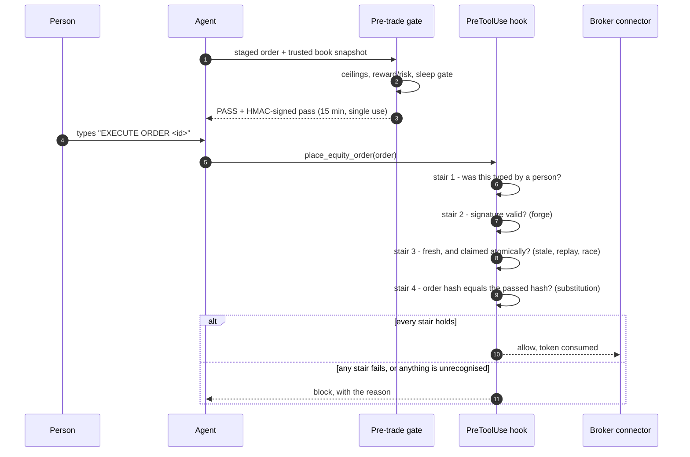

# Architecture

Osanwe is a Markdown vault with an agent contract in front of it and a toolchain underneath. There is no
server and no database of record: the files are the record, git is the history, and every generated view can
be rebuilt from the typed notes it came from.

## The four layers

**1. Contract.** `AGENTS.md` states what any agent operating the system may and may not do: where it may
write, what evidence a numeric claim needs, which actions require explicit authorisation, and which ledgers
are append-only. `CLAUDE.md` is a one-line stub, `@AGENTS.md`, that imports it, so every harness reads the one
file. A router check verifies the stub and that the bootstrap document embeds the right source hash.

**2. Skills.** Each skill is a directory under `.agents/skills/<name>/` with a `SKILL.md` and its reference
documents. A skill is a procedure, not a prompt fragment: it names its phases, its inputs, the tools it may
call, the gates it must pass, and what it writes. `.claude/skills/` and `.codex/` hold generated mirrors for
the other harnesses; the canonical copy is always under `.agents/`.

**3. Tools.** `tools/` holds the code the skills call: scoring and sizing kernels, point-in-time data
handling, the relay that delegates work to a local model, validation suites and their tests. Tools are plain
Python, runnable outside any agent, and most have a test that names them.

**4. Vault.** `Atlas/` holds durable reference material; `wiki/` holds generated research, analyses and
maintenance reports; entity notes carry per-company state. Generated views (the session cache, ledger views)
are rebuilt by scripts and never hand-edited.

## Control points

- **Hooks** sit on the harness lifecycle: prompt logging, context injection, session integrity, post-compaction
  re-injection, subagent telemetry, tool-failure capture, and a pre-write validator that refuses Markdown
  which breaks the vault's schema.
- **The pre-trade gate** is the safety barrier in front of the brokerage integration. It default-blocks any
  tool name it does not recognise as a read, which means a new write tool is blocked by being new.
- **Gates** (`/gate b`, `/gate f`, `/gate t`) are decision procedures with recorded verdicts, so a build, a
  financial action or a thesis change cannot be ratified by assertion alone.

## Design decisions

Seven decisions that shaped how agents operate this system. Each states the problem, the choice, the tradeoff
accepted, and where to check it.

### 1. An irreversible action climbs a staircase, and every stair fails closed

**The problem.** An agent with a brokerage connector can place an order. The model deciding to place one is
not evidence that a person asked for it: the model reads filings, news and web pages all day, and any of
that text can contain an instruction. A single confirmation step does not help, because the thing being
confirmed and the thing being executed can differ.

**The choice.** An order executes only when four independent conditions hold at once, checked by a
PreToolUse hook that sees every call to the connector. Each condition answers a different attack, using the
labels in the hook's own docstring:

| Stair | What it requires | Attack it answers |
|---|---|---|
| 1 | the phrase `EXECUTE ORDER <id>` in the latest turn a **person typed** | A8, an injected or model-authored approval -- **stair 1 does not currently achieve this; see below** |
| 2 | an HMAC-signed pass, issued only by the gate on a clean evaluation | A1 forge, A6 direct call with no gate |
| 3 | the pass inside its 15-minute life, and claimed atomically once | A5 stale, A5 replay, and the race |
| 4 | the order about to execute hashing identically to the order that passed | A7 substitution, and the gap between check and use |

Option orders, and any tool the hook does not recognise, are refused outright at the same hook, whatever else
holds.
Any error, missing field or unrecognised shape blocks. Exit 0 is the only way through, and nothing defaults
to it.

**The tradeoff accepted.** Placing an order is deliberately tedious: stage it, evaluate it, type the
authorising phrase, and do it inside fifteen minutes or start again. The system cannot act on a good idea
at speed. That is the point, and it is the wrong design for anything that needs to trade quickly.

**Stair 1 does not currently hold, and this is the honest state of it.** Stairs 2, 3 and 4 held in every case
tested and are demonstrated end to end by `demo/run_staircase_demo.py`. Stair 1 was attacked in three rounds of
independent adversarial review and failed each time; four patches were written and the third review showed
the fourth was a regression on the third, so the work was stopped rather than patched again. Four defects
remain open in this tree -- D70, D72, D73 and D74 -- and the table in
[docs/threat-model.md](docs/threat-model.md#open-defects-in-stair-1) states each one.

The replacement is described under decision 2. It is not in this tree. **Meanwhile the operative control is
the harness permission layer: every order, cancel and alert tool the connector exposes is denied, among 30
denied broker tools with zero `allow` and zero `ask` entries.** No order
can be placed regardless of this hook.

**What this does and does not defend against.** Taking stairs 2 to 4 as the part that works, it defends
against a model that is confused or misled by text it read: approvals that are stale, replayed, substituted,
or absent altogether. **It does not defend against an agent induced to run shell commands against the
control files.**
Such an agent can supply every stair's inputs, because the signing key, the pass directory and the session
transcript are all ordinary files that a shell can write. The `defeats` labels above are true within that
model and not outside it. The one control that sits outside the agent's reach is on the broker's side: the
connector marks each account with whether it is tradable by an agent at all.

**Check it:** `.claude/hooks/pretrade-token-gate.py`, `tools/pretrade_lib.py`, the design brief at
`.agents/hooks/briefs/pretrade-token-gate.md`, the deny list in `.claude/settings.json`, and `demo/` for a
runnable walk up all eleven cases.

### 2. When a control keeps failing review, stop patching it and redesign it against properties

**The problem.** Stair 1 has to answer "did a person type this, just now, about this order?". The shipped
code answers it by rejecting three known-bad transcript shapes and accepting everything else. A denylist of
shapes has its failure built in: every new kind of entry the harness invents is accepted by omission, from
the day it ships.

**What was tried, and what happened.** Four patches, each attacked end to end by an independent reviewer
driving the real hook. Each broke. The first reviewer found eight shapes that authorised an order; the
second showed the first patch's premise was false; the third broke the fourth patch in seven ways and showed
it was a regression on the third -- a turn the person typed to *cancel* was stepped over and an older
approval promoted. None of the four shipped. **The code in this tree is still the original denylist**, with
the open flaws D70, D72, D73 and D74 named under decision 1 and stated in `docs/threat-model.md`.

**The choice.** Stop patching. Write the security properties down first, have a fresh reviewer attack the
*specification* before any code exists, implement, then attack the implementation end to end with the
explicit goal of placing an order, and send anything that gets through back to the design rather than to
a patch. The first attack on the first draft of that design found two critical holes before a line was
written, and both became structural rules:

- **The scan's default is to stop.** Only a small, closed, positively identified set of machine artifacts is
  stepped over; every other entry -- including every shape nobody has seen yet -- stops the scan and must
  itself be a valid authorisation or the order is refused. The draft had made refused entries transparent,
  which is the same mistake the fourth patch made.
- **The person authors the order.** The draft bound the approval to a digest the gate printed and the person
  copied. But the model runs the gate and writes the message the person reads, so it could show one order's
  summary above another order's digest. In the redesign the person types the order itself -- side,
  quantity, symbol, type, price, account -- and only exactly that can execute.

**The tradeoff accepted.** A first stair that stays broken until the redesign merges, and a redesign that is stricter to use: the
person types a forty-character line instead of an id, and anything they do after typing it revokes it.
Measured over real sessions, nothing intervenes between a typed turn and the model's next tool call in
98.7% of exchanges, so the strictness costs little -- but it is paid every time.

**Where to check.** The redesign is specified, attacked and held on a branch that is not merged into this
tree. What protects the account meanwhile is the permission deny list, not this stair.

### 3. An unknown tool is a blocked tool

**The problem.** A connector's tool list is not fixed. The provider adds tools, and an agent's permission
configuration is a list of names written on some earlier day. A new state-changing tool arrives already
outside every deny rule.

**The choice.** The hook sees every call to the connector and default-blocks any name it does not recognise
as a read. A new tool is blocked by being new. The read allowlist is explicit and is kept beside the
registry it mirrors.

**The tradeoff accepted.** Legitimate new read tools break until someone adds them, and the two lists can
drift apart. They have: the registry lists 51 read tools where the hook allows 34, so 17 live reads fail
closed today. That is a capability limit rather than a safety gap, and widening it is a decision left open
rather than taken quietly. A comment above the allowlist once invited exactly the "resync" that would arm
the surface; it now records the gap instead.

**Check it:** the unknown-name branch in `.claude/hooks/pretrade-token-gate.py`, `.agents/mcp/servers.json`,
and step 2 of `demo/`.

### 4. One contract, disclosed progressively

**The problem.** An agent contract that states every rule up front is either too long to be followed or too
short to be complete, and a second copy of it drifts from the first.

**The choice.** `AGENTS.md` is the contract: what any agent may do, where it may write, what evidence a
numeric claim needs, which actions need authorisation, which ledgers are append-only. It states the rules
that always apply and points at the document that owns each specialised procedure, so a session loads the
detail it needs and not the rest. A router check verifies the contract against the harness copies and the
bootstrap document's source hash, so the copies cannot quietly diverge.

**The tradeoff accepted.** Pointers only work if an agent follows them, and a rule stated in a referenced
document is weaker than one stated in the contract. Anything load-bearing therefore stays in the contract
itself, which keeps it longer than a summary would be.

**Check it:** `AGENTS.md`, `tools/router-check.py`, `docs/compatibility.md`.

### 5. Context is re-injected after compaction, because a summary is not the contract

**The problem.** A long session is compacted: the conversation so far is replaced by a summary. The summary
is written to preserve the work, not the rules, so the contract can quietly leave the session while the
agent keeps acting -- including on money.

**The choice.** A PostCompact hook re-injects the session's standing context after every compaction, so the
rules are present again immediately rather than at the next session.

**The tradeoff accepted.** It costs context immediately after the moment context ran out, which is the
worst possible time to spend it. The alternative is an agent operating on a summary of its own rules.

**A second reason, learned the hard way.** The compaction summary is also model-authored text shaped like a
human turn, which is how it came to satisfy the order gate's first stair. Decision 2 is the other half of
this one.

**Check it:** `.claude/hooks/post-compact-reinject.py`, `.claude/hooks/pre-compact.py`.

### 6. Delegation to a local model is contained, and its output is not trusted

**The problem.** Bulk work -- reading many documents, extracting many claims -- is expensive at frontier
prices and does not need frontier judgment. A local model is cheap. It is also less reliable, and giving it
the tools to be useful gives it the tools to do damage.

**The choice.** A relay worker runs against a local model inside a read jail with an explicit path denylist,
and its output is treated as a claim rather than a result: figures are checked mechanically before anything
is written, and an approval checkpoint stands between its proposals and any edit to the vault.

**The tradeoff accepted.** The orchestration costs more to build and more to run than calling the local
model directly, and the checkpoint means the cheap path is not the fast path.

**Where it failed, and what that shows.** The jail excluded the private and credential directories but not
`.env` files or `auth.json` -- the two the contract names explicitly -- so a worker with web egress could
read and search them from anywhere in the vault. It was found by auditing the jail against the contract
rather than by anything going wrong, and it is fixed on a branch. A containment boundary is only as good as
the last time somebody checked it against what it was supposed to contain.

**Check it:** `tools/relay.py`, `tools/lib/relay_exec.py`, `config/local-lane.json`.

### 7. Ledgers are append-only, and every view of them is generated

**The problem.** A record of what was decided is worth nothing if the thing that writes it can also rewrite
it. Agents summarise, tidy and correct by default, and an agent tidying a decision log destroys the only
evidence of what was actually decided.

**The choice.** Decisions, sessions and execute-or-decline records are append-only. A correction is a new
entry that supersedes an earlier one; nothing is edited in place. Every human-readable view of them --
including the session cache the next session reads first -- is generated from the underlying entries, so a
view can always be rebuilt and never becomes the source of truth.

**The tradeoff accepted.** The ledgers only grow, they contain their own mistakes forever, and reading them
means reading corrections alongside the things corrected. A tidier record would be a less trustworthy one.

**Check it:** `tools/gen-ledger-views.py`, `tools/append-only-check.py`, and the append-only rules in
`AGENTS.md`.

## Hashing and pins

The system hashes its own artefacts in three widths, for three different jobs:

| Width | Form | Job |
|---|---|---|
| 64 hex | full sha256 | File and fixture integrity: test fixtures, index manifests, contract documents |
| 16 hex | truncated sha256, called a *pin* | Dataset identity: which build of a data store a result came from |
| 8 hex | truncated sha256, called a *fingerprint* | Doctrine identity: which version of the sizing doctrine and its bands an analysis was scored under |

What was measured, and what it means for this copy:

- Across the working system, **84 stored hashes covering 15 mechanisms** were recomputed. **76 matched and 8
  did not.** Six of the matches hold only against the working tree's line endings and would fail in a fresh
  clone, so a published copy must be re-hashed or have the pin removed.
- Counting all three widths, this public copy carries digests in **29 files: 91 occurrences, 56 distinct**
  -- 51 full sha256 values, 30 doctrine fingerprints and 10 short dataset pins. Recounted over the finished
  tree, after the build recomputed 7 digests over published bytes and replaced 19 with a note.
- In the working system those digests resolve to **36 published files, 5 sanitized ones, 5 withheld ones and
  18 awaiting review**, and **69 match no file at all** -- external pins, canonical-JSON fingerprints and
  example values. The withheld group is the one that matters to a reader here: those checks cannot run in
  this copy, because what they cover is not in it.
- **65 published digests are checked by no working-system verifier.** They are recorded, not enforced. A
  reader should treat them as provenance labels, not as guarantees.
- Where a digest covered withheld data, it was removed and a one-line comment left in its place, so the hole is
  visible in the code rather than silent.

The honest summary: hashing in this system is good at proving a fixture has not drifted, and it is not a
tamper-evidence scheme. Most of what it records, nothing checks.

## Data flow of a typical analysis

1. A skill loads its reference documents and the entity note for the subject.
2. Point-in-time tools fetch filings and series, recording retrieval time alongside publication time, so a
   later reader can tell what was knowable when.
3. Formulas score the subject. Each formula is published, and the index in `docs/quant-formula-index.md` says
   whether it has been checked against an independent expected value.
4. A critic pass argues the other side before any verdict is written.
5. The verdict, its evidence grades, its falsifiers and its doctrine fingerprint are written to an analysis
   note; the decision, if any, goes to an append-only ledger.

Steps 2 through 5 are where the system's claim to usefulness lives: not in producing an answer, but in
producing one whose inputs, transformations and failure conditions are all inspectable afterwards.

## What this copy cannot do

The data directories are empty, the credentials are absent, the paths are placeholders, and the ledgers are
withheld. The code and the procedures are complete; the state they operated on is not. See `docs/audit.md`.
