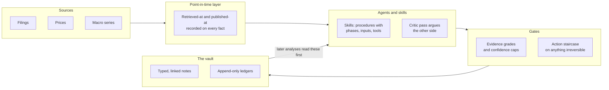

# Osanwe

[](https://github.com/Seth090502/osanwe-public/actions/workflows/tests.yml)

*Designed and directed by Seth Young -- as the architect, orchestrator and evaluator of the agents that built it.*

**A Markdown vault for financial analysis, operated by AI agents of any vendor, in which every analysis is
written back as typed, linked notes that later analyses read first.**

That last clause is the whole idea. An analysis is not a chat answer that disappears. It is a note with a
schema: a rating, the evidence behind it with a grade on each claim, the falsifiers that would overturn it,
and links to the notes it drew on. The next analysis of the same company loads those notes before it looks
at anything new, scores its own prior calls, and records where the new evidence contradicts the old.

You can read that happening in **[`examples/01-equity-analysis-end-to-end.md`](examples/01-equity-analysis-end-to-end.md)**,
the third dated analysis of the same semiconductor company, written with the stock down about twenty
percent. It opens by loading the two earlier ones. Its **prior-calls scoreboard** grades what those runs
said against what happened, and its **drift table** lists, row by row, every prior claim the new evidence
changed, how severely, and what to do about it. The two earlier analyses are not in this copy: they state
the author's own positions, which is the one kind of fact this repository does not publish.

Nothing in that chain is retrieval of a chat log. It is the system reading its own typed output and being
made to answer for it.

## How the pieces fit



## Three things worth checking

**1. Irreversible actions climb a staircase, it was attacked until it broke, and the repair was stopped
rather than shipped.**
The agent holds a live brokerage connector. An order executes only when four things hold at once: the
phrase `EXECUTE ORDER <id>` in the latest turn **a person typed**, an HMAC-signed pass from a clean gate
evaluation, that pass fresh and claimed atomically once, and the executing order hashing identically to the
order that passed. Every error path blocks. **Stairs 2, 3 and 4 hold and you can watch them hold** --
`demo/run_staircase_demo.py` forges a signature, substitutes an order under a valid pass, back-dates a pass
past its TTL and replays a consumed one, and each is refused in front of you.

**Stair 1 -- deciding whether a person really typed the phrase -- does not hold.** Three rounds of adversarial review found order-placing bypasses in it. The first found eight
transcript shapes, including the model's own compaction summary, which meant text the model had merely
*read* could re-enter the session as an approval. Four patches followed. The third review broke the fourth
patch in seven ways and showed that the patch was a **regression on its own predecessor**: a turn the person
typed to *cancel* an order was stepped over, and an older approval was promoted in its place. At that point
the work stopped instead of producing a fifth patch.

Four defects remain open in this tree, all in stair 1:

| Defect | The flaw |
|---|---|
| [D70](THREAT-MODEL.md) | Machine-written entries -- a compaction summary, a subagent's hand-back, hook-injected text, a slash-command expansion, command output -- are read as turns **a person typed**. The fourth patch meant to fix this instead stepped past a typed revocation, and was retired. |
| [D72](THREAT-MODEL.md) | Authorization is bound to an id **the model chooses**, not to the order's contents. Nothing in the phrase constrains symbol, side or size. |
| [D73](THREAT-MODEL.md) | The authorising phrase **never expires**. The 15-minute TTL protects the pass, not the approval. |
| [D74](THREAT-MODEL.md) | Four parsing and filter bugs: the first id in a turn wins, so a quoted one beats the person's; a phrase or a marker can be assembled across two text blocks; an unreadable provenance field authorises; a falsy subagent flag is accepted. |

A replacement is specified and under attack rather than patched a fifth time. In it the person types the
order itself -- side, quantity, symbol, type, price, account -- and only exactly that can execute; and the
scan stops at the newest entry that is not a known machine artifact, so anything the person does after
authorising revokes it. It is attacked before any code is written and held on a branch outside this tree.

**What is actually protecting the account meanwhile, and it is not this code:** every order, cancel and
alert tool the connector exposes -- ten, plus twenty older names -- sits in the harness permission **deny**
list: 30 denied broker tools, zero `allow`, zero `ask`. No order can be placed today regardless of the gate, and nothing lifts that until the redesign is
reviewed and merged by hand.

*Scope, stated plainly:* the staircase defends against a model confused or misled by text it read. It does
not defend against an agent induced to run shell commands against the control files; the one control outside
that reach is on the broker's side, which marks each account with whether an agent may trade in it at all.
-> [`ARCHITECTURE.md`](ARCHITECTURE.md) decisions 1 and 2, [`THREAT-MODEL.md`](THREAT-MODEL.md) Part A,
[`docs/ORCHESTRATION.md`](docs/ORCHESTRATION.md) for how the stop was decided.

**2. The modelling is published with its defects marked, not cleaned up.**
193 formulas are inventoried and each carries a verdict. **21 of them are wrong**, split into specification
gaps and computational defects, and each one says which. They are published as they were found.
-> [`docs/quant-formula-index.md`](docs/quant-formula-index.md).

**3. The claims about what works were made by running it, and the suites run on someone else's machine.**
352 of 467 executable components were run and did what they should; the rest are counted and explained
rather than rounded away. 50 of the 72 published test files pass from a clean copy, and 49 of them run in CI
on every push -- the fiftieth grades a local language model, which CI does not have -- so the number is
checkable without trusting it.
-> [`CAPABILITIES.md`](CAPABILITIES.md), [`AUDIT.md`](AUDIT.md), and the badge above.

## Run the staircase yourself, in about a minute

From a clean clone, no network, no secrets, standard library only:

```
python demo/run_staircase_demo.py
```

It drives the real hook as a subprocess against synthetic orders and transcripts in a temporary directory
and prints the hook's own reason for each of eleven cases: a read tool passes; an unknown broker tool is
blocked; an option order is blocked outright; an order with no phrase; the phrase arriving inside a tool
result; the phrase with no pass; a forged pass; a valid pass with an altered order; an expired pass; all
four conditions together, allowed and the token consumed; and the same order replayed, blocked. It ends
with a count and exits non-zero on any mismatch. The allowed case is the point: a demo where everything
blocks cannot tell a working defence from a gate that blocks everything.
See [`demo/README.md`](demo/README.md), which also carries the captured output.

## What it models

Every formula in the system, by domain, with how it is implemented and how it checked:

| Domain | Formulas | In code | Prompt-only | Checked pass | Mismatch | Not checkable |
|---|---|---|---|---|---|---|
| Valuation | 31 | 0 | 31 | 26 | 3 | 2 |
| Forensic accounting scores | 16 | 0 | 16 | 13 | 3 | 0 |
| Factor work | 32 | 16 | 16 | 26 | 4 | 2 |
| Sizing and Kelly | 40 | 26 | 14 | 38 | 2 | 0 |
| Risk and correlation | 12 | 4 | 8 | 10 | 1 | 1 |
| Macro regime gates | 5 | 3 | 2 | 4 | 1 | 0 |
| Options layer | 12 | 6 | 6 | 11 | 1 | 0 |
| Calibration | 23 | 22 | 1 | 19 | 4 | 0 |
| Rating and evidence gates | 22 | 4 | 18 | 19 | 2 | 1 |
| **Total** | **193** | **81** | **112** | **166** | **21** | **6** |

"Prompt-only" means the formula is specified in a document the model reads and applied by the model, with no
code implementing it. That is all of the valuation and forensic work and one of the 23 calibration formulas,
and it is the single most important thing to understand about what this system is: the rating engine is
largely written prose, not a program.

Three things sit underneath all of it. A **point-in-time layer** records when a fact was published and when
it was retrieved, separately, so a later reader can tell what was knowable when. **Evidence grading** puts a
grade on each claim and caps the confidence a conclusion may state, so a conclusion cannot be more certain
than its worst load-bearing input. **Provenance tags** record, per number, whether it came from a live tool
read, a script, or the web, with a timestamp.

## If you have five more minutes

- [`AUDIT.md`](AUDIT.md) -- every check run over this repository, what it found, and **what each check cannot
  detect**, including the audit's own worst mistake.
- [`docs/ORCHESTRATION.md`](docs/ORCHESTRATION.md) -- how long-horizon agent work is governed here: a
  governing brief, approval gates with literal words, a verbatim decision log, state on disk so sessions
  resume, worktree isolation.
- [`docs/EVALS.md`](docs/EVALS.md) -- what is evaluated and how, including the calibration record showing
  stated confidence running ahead of realized outcomes, and what the sizing method does about it.
- [`examples/02-factor-backtest-rejected.md`](examples/02-factor-backtest-rejected.md) -- a backtest whose
  answer was "reject", kept because the negative result is the useful one.
- [`WITHHELD.md`](WITHHELD.md) -- what is not in this copy and why.

## How this was built

The work was directed, not typed. The author set the objectives and the acceptance criteria, designed the
architecture, decomposed it into bounded pieces, orchestrated model agents to implement them, and evaluated
what came back against those criteria, accepting, rejecting or re-scoping each piece. In the private working
repository, 2,564 of 3,062 commits carry the agent prefix; this public copy has its own, much shorter
history and does not show them.

That division is the point rather than a caveat. The judgment here is about what the system must refuse to
do and how a refusal is proved: which claims need a source, where a gate has to fail closed, what a check
cannot detect. The implementation followed from those decisions. Read the code as the product of that
process and judge it accordingly.

## Limitations you should know before using any of it

1. **This copy is a mirror, not a deployment, and it has never been run end to end from a clean clone.**
   Individual test files were executed from a fresh copy; the system as a whole was not. Paths that pointed
   at the author's machine are placeholders, secrets are absent, and the data directories are empty.
2. **Most `/invest` rating rules are prompt text, not code.** See the table above: 112 of 193 formulas have
   no implementation.
3. **Retrieval is keyword search over a small admitted set, not a vector index.** The index build script and
   schema are here; the index itself is not, because it was built over withheld material.
4. **50 of the 72 published test files pass from a clean copy.** The other 22 are excluded and named in
   `AUDIT.md`, not loosened. Most fail because they read withheld data.
5. **Execution evidence comes from the originals.** Tests were run against the working system; the published
   copies were checked for equivalence instead. `AUDIT.md` gives the numbers and the gaps.
6. **The skeptic check never runs.** Its entry point fail-closes on every call. It is recorded, not hidden.
7. **The vault root is hardcoded in many places.** 132 of 500 tracked code files carry an absolute path.
   This is defect D53, and it is not cosmetic: it prevented a security fix from being verified on the branch
   where it was written.
8. **Known defects are published, not silently fixed**, and some formulas are wrong. See point 2 and the
   formula index.
9. **Nothing here places an order.** Order tools are denied by configuration, the gate blocks any unknown
   tool name, and no credential is present.

## Licence

Code is MIT (`LICENSE`). Everything that is prose rather than code -- `Atlas/`, `wiki/`, `docs/`, the
research exemplars under `examples/`, and the Markdown portions of the skills -- is copyright the author,
all rights reserved, shared for demonstration (`LICENSE-DOCS`): read it and quote it with attribution, but
do not redistribute it as a corpus or use it as training data. Where a file mixes both, the code blocks are
MIT and the surrounding prose is not. Third-party material keeps its own licence.

Everything about the author beyond their name -- holdings, accounts, health, employer, location -- is
withheld from this copy by design. Nothing here is investment advice.
