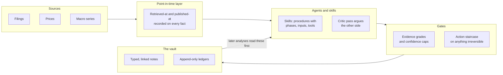

# Osanwe

[](https://github.com/Seth090502/osanwe-public/actions/workflows/tests.yml)

A Markdown vault for financial analysis, run by AI agents, in which every analysis is written back as typed,
linked notes that the next analysis reads first. Research compounds instead of evaporating.

*Designed and directed by Seth Young, as architect, orchestrator and evaluator of the agents that built it.*

In the working system, of which this repository is a partial copy: 17 skills, 14 subagents, 27 hook
registrations across 10 lifecycle events, 193 formulas across nine domains, 662 research outputs, and 3,062
commits from April to 21 September 2026, 2,564 of them made by AI agents under the agent-commit prefix.
Here, 49 test suites pass on GitHub's runners on every push.

## What this demonstrates, and where to check it

| Capability | Evidence |
|---|---|
| Guarding irreversible agent actions: fail-closed stairs, prompt-injection transcript cases run in CI, red-teaming of the author's own controls | [Staircase demo](demo/README.md); [THREAT-MODEL.md, A2](THREAT-MODEL.md#a2-fetched-content-that-carries-instructions); [the injection cases](tools/test-pretrade-transcript-provenance.py) |
| Multi-agent orchestration: specialist subagents in parallel waves, an adversarial critic before the analysis is written | [Example 1, subagent audit](examples/01-equity-analysis-end-to-end.md#subagent-audit); [invest skill, Phase K.5](.agents/skills/invest/SKILL.md#phase-k5-variant-view----thesis-critic-adversarial-cross-check-delegated-phase-c-wiring-2026-05-02) |
| Evals: a call record reported with its denominator, the old rating logic kept as a shadow with a pre-committed rollback trigger | [docs/EVALS.md, section 4](docs/EVALS.md#4-the-prior-calls-record-which-is-too-small-to-calibrate); [invest skill, Phase R](.agents/skills/invest/SKILL.md#phase-r-calibration-continuity-monitor-verdict-redesign-2026-06-06-conditional-ratify-rolling-check) |
| Context engineering: typed notes as memory, progressive disclosure in the agent contract, re-injection after compaction | [ARCHITECTURE.md, decisions 4 and 5](ARCHITECTURE.md#4-one-contract-disclosed-progressively) |
| Deterministic control around a probabilistic model: a pre-write schema hook, recorded gate verdicts, append-only ledgers | [ARCHITECTURE.md, control points](ARCHITECTURE.md#control-points); [the write validator](tools/pre-write-validator.py) |
| Tool integration over MCP: filings, macro series and a brokerage, with published and retrieved times recorded | [MCP registry](.agents/mcp/servers.json); [point-in-time records](tools/pit/financial_documents.py) |
| Quantitative finance: 193 formulas across nine domains, each with a checked verdict | [docs/quant-formula-index.md, check results](docs/quant-formula-index.md#check-results) |
| Governing long-running agent work: written briefs, approval gates, a verbatim decision log, worktree isolation | [docs/ORCHESTRATION.md](docs/ORCHESTRATION.md#the-parts) (the method; the briefs and logs are withheld) |
| Reproducibility and portability: 49 suites in CI, a one-command demo, one agent contract loaded by Claude Code and Codex | [CI workflow](.github/workflows/tests.yml); [COMPATIBILITY.md, runtime receipts](COMPATIBILITY.md#september-recovery-runtime-receipts) |

## The idea

An analysis here is not a chat answer. It is a note with a schema: a rating, the evidence behind it with a
grade on every claim, the falsifiers that would overturn it, and links to what it drew on. The next analysis
of the same company loads those notes first, checks its predecessors' calls against the returns since, and
records where new evidence contradicts old.

Each full analysis runs as a team. Specialist subagents fetch prices, score the filings forensically and read
insider positioning in parallel waves, and a thesis critic argues the opposing case before the analysis is
written. The critic's failure modes set the conviction figure and the kill criteria; by design they do not
change the rating. Conviction is computed from stated inputs rather than asserted: from a base, each named
failure mode's probability, severity and detectability are multiplied and subtracted, so every step is on the
page, including the judgment calls that feed it.

[Example 1](examples/01-equity-analysis-end-to-end.md) shows the loop: the third dated analysis of one
semiconductor company, written after a sharp three-day fall in its share price. It loads the two earlier
runs, lists their calls with the return since each in a
[prior-calls scoreboard](examples/01-equity-analysis-end-to-end.md#inconsistencies-vs-prior-research-phase-j5--prior-calls-scoreboard),
and logs every claim the new evidence moved in a drift table, with severity and action. The two earlier
analyses are not in this copy: they state the author's own positions, which is the one kind of fact this
repository does not publish.



## What to look at first

### 1. Irreversible actions are guarded in layers, and the layers are tested by attacking them

The agents hold a live brokerage connection. Between the model and an order sit three layers: a permission
deny list covering every order, cancel and alert tool (30 broker tool names, none allowed); an order gate built
as a four-stair staircase; and, at the broker, a setting that decides whether an agent may trade at all. The
staircase is designed to admit an order only when the phrase `EXECUTE ORDER <id>` appears in the latest turn
a person typed, an HMAC-signed pass came from a clean gate evaluation, that pass is fresh and claimed once by
atomic operation, and the executing order hashes identically to the order that passed. Stairs two to four fail
closed on every error path; stair one does not always, as below.

Run the demo below and watch stairs two to four refuse a forged signature, a swapped order, an expired pass
and a replay, then admit the one order that satisfies all four.

The gate was then red-teamed by independent agents whose only goal was to place an order through it. Three
rounds found ways past stair one; the most instructive was text the model had merely read re-entering the
session as an approval through its own compaction summary. When successive patches kept failing review, the
work stopped rather than ship another, and stair one is being redesigned from stated properties: the person
types the order itself, and only exactly that order can execute. Until the redesign survives a full attack,
the deny list keeps every order tool closed. The four open defects are tabled in
[THREAT-MODEL.md](THREAT-MODEL.md#open-defects-in-stair-1); how the stop was decided is in
[docs/ORCHESTRATION.md](docs/ORCHESTRATION.md#the-worked-case-four-patches-and-the-decision-not-to-write-a-fifth).

### 2. Every formula in the quantitative layer carries a checked verdict

193 formulas across valuation, forensic accounting, factor models, Kelly sizing, risk and correlation, macro
regime gates, options, calibration and rating gates. When checked, 166 passed and 21 mismatched. A formula
counts as checked only where its expected value was derived independently from its definition, never from the
implementation's own output, and each mismatch is published with what the code or the specification gets
wrong. The remaining 6 cannot be checked and say why. The verdicts record the check, not today's code: the five
computational defects its first pass found have since been fixed, and the index says so. Code carries most of the sizing math (26 of 40 formulas) and nearly
all of the calibration (22 of 23); valuation and forensic scoring are specified in prose that the model
applies. A point-in-time layer records when each fact was published and when it was retrieved, so a later
reader can tell what was knowable when, and evidence grading caps the confidence an analysis may state by the
grades and freshness of the claims it cites
([the cap rules](.agents/skills/invest/ref-analysis-template.md#71-evidence-grade-confidence-cap-methodology)).
See the table below and [docs/quant-formula-index.md](docs/quant-formula-index.md).

### 3. The system measures itself, and says when the measurement is too thin

Each refresh of a company checks the earlier calls against the returns since. A change to the rating logic is
not trusted on assertion: after the last one, the old logic kept running as a shadow beside the new, each call
logs both ratings, and a pre-committed rollback trigger compares their Brier scores once eight logged calls
have three months of realized returns. The call record is reported with its denominator rather than as a
track record: 5 scored BUY calls are too few to calibrate, and the evals page says so. Of the 467 components
the audit tracked, 352 were run and did what they should; the other 115 are counted and explained. See
[docs/EVALS.md](docs/EVALS.md#4-the-prior-calls-record-which-is-too-small-to-calibrate),
[tools/score-outcomes.py](tools/score-outcomes.py) and [CAPABILITIES.md](CAPABILITIES.md#the-headline).

### 4. Long-running agent work is governed rather than supervised turn by turn

The audit that produced this release ran as agent work under a written brief, with approval gates keyed to
literal words, a verbatim decision log, state on disk that survives session resets, and worktree isolation
from the live system. Agents inventoried and classified 25,478 files, verified 352 components by running
them, and built this sanitized mirror. [docs/ORCHESTRATION.md](docs/ORCHESTRATION.md#where-the-agent-stopped-itself)
records where the agents stopped for a human decision and where the method failed.

## Run the staircase yourself

From a clean clone, no network, no secrets, standard library only:

```
python demo/run_staircase_demo.py
```

It drives the real hook as a subprocess against synthetic orders and transcripts in a temporary directory
and prints the hook's own reason for each of eleven cases: a read tool passes; an unknown broker tool is
blocked; an option order is blocked outright; an order with no phrase; the phrase arriving inside a tool
result; the phrase with no pass; a forged pass; a valid pass with an altered order; an expired pass; all
four conditions together, allowed and the token consumed; and the same order replayed, blocked. It ends
with a count and exits non-zero on any mismatch. The allowed case is the point: a demo where everything
blocks cannot tell a working defence from a gate that blocks everything.
[`demo/README.md`](demo/README.md) says what the run shows and what it does not.

## What it models

Every formula in the system, by domain, with how it is implemented and how it checked:

| Domain | Formulas | In code | Prompt-only | Checked pass | Mismatch | Not checkable |
|---|---|---|---|---|---|---|
| Valuation | 31 | 0 | 31 | 26 | 3 | 2 |
| Forensic accounting scores | 16 | 0 | 16 | 13 | 3 | 0 |
| Factor work | 32 | 16 | 16 | 26 | 4 | 2 |
| Sizing and Kelly | 40 | 26 | 14 | 38 | 2 | 0 |
| Risk and correlation | 12 | 4 | 8 | 10 | 1 | 1 |
| Macro regime gates | 5 | 3 | 2 | 4 | 1 | 0 |
| Options layer | 12 | 6 | 6 | 11 | 1 | 0 |
| Calibration | 23 | 22 | 1 | 19 | 4 | 0 |
| Rating and evidence gates | 22 | 4 | 18 | 19 | 2 | 1 |
| **Total** | **193** | **81** | **112** | **166** | **21** | **6** |

What "prompt-only" means, and what sits underneath the formulas, is in
[point 2](#2-every-formula-in-the-quantitative-layer-carries-a-checked-verdict) above.

## If you have five more minutes

- [`AUDIT.md`](AUDIT.md) -- every check run over this repository, what it found, and **what each check cannot
  detect**, including the audit's own worst mistake.
- [`docs/ORCHESTRATION.md`](docs/ORCHESTRATION.md) -- how long-horizon agent work is governed here: a
  governing brief, approval gates with literal words, a verbatim decision log, state on disk so sessions
  resume, worktree isolation.
- [`docs/EVALS.md`](docs/EVALS.md) -- what is evaluated and how, including a call record that is too small to
  calibrate and is reported with its denominator instead of as a hit rate.
- [`examples/02-factor-backtest-rejected.md`](examples/02-factor-backtest-rejected.md) -- a backtest whose
  answer was "reject", kept because the negative result is the useful one.
- [`WITHHELD.md`](WITHHELD.md) -- what is not in this copy and why.

## How this was built

The work was directed, not typed. The author set the objectives and the acceptance criteria, designed the
architecture, decomposed it into bounded pieces, orchestrated model agents to implement them, and evaluated
what came back against those criteria, accepting, rejecting or re-scoping each piece. In the private working
repository, 2,564 of 3,062 commits carry the agent prefix; this public copy has its own, much shorter
history and does not show them.

That division is the point rather than a caveat. The judgment here is about what the system must refuse to
do and how a refusal is proved: which claims need a source, where a gate has to fail closed, what a check
cannot detect. The implementation followed from those decisions. Read the code as the product of that
process and judge it accordingly.

## Limitations you should know before using any of it

1. **A mirror, not a deployment:** it has never been run end to end from a clean clone; paths are placeholders, secrets are absent, data directories are empty. [THREAT-MODEL.md, open risks](THREAT-MODEL.md#open-risks)
2. **Most `/invest` rating rules are prompt text, not code:** 38 of the 65 formulas on its scoring path, and 112 of 193 overall, have no implementation. [docs/quant-formula-index.md, coverage](docs/quant-formula-index.md#coverage)
3. **Retrieval is keyword search over a small admitted set, not a vector index.** [CAPABILITIES.md, known weak points](CAPABILITIES.md#known-weak-points)
4. **50 of the 72 published test files pass from a clean copy,** one of them only with a local model running; the other 22 are named with their causes, not loosened. [AUDIT.md](AUDIT.md#what-was-executed-and-what-was-not)
5. **Execution evidence comes from the originals;** the published copies were checked for equivalence instead. [AUDIT.md](AUDIT.md#execution-evidence-and-what-replaced-it-here)
6. **The `/invest` skeptic wave never runs:** its entry point fails closed on every call. [CAPABILITIES.md, known weak points](CAPABILITIES.md#known-weak-points)
7. **The vault root is hardcoded:** in the working system, 132 of 500 tracked code files carry an absolute path; here it is a placeholder. [CAPABILITIES.md, known weak points](CAPABILITIES.md#known-weak-points)
8. **Formula defects are published as found:** 21 formulas did not match their definitions when checked; the five computational defects are fixed since. [docs/quant-formula-index.md](docs/quant-formula-index.md#the-findings-tagged)
9. **Nothing here places an order:** order tools are denied by configuration, the gate blocks any unknown tool name, and no credential is present. [THREAT-MODEL.md, A1](THREAT-MODEL.md#a1-the-agent-has-broker-tools-and-the-account-is-real)

## Licence

Code is MIT (`LICENSE`). Everything that is prose rather than code -- `Atlas/`, `wiki/`, `docs/`, the
research exemplars under `examples/`, and the Markdown portions of the skills -- is copyright the author,
all rights reserved, shared for demonstration (`LICENSE-DOCS`): read it and quote it with attribution, but
do not redistribute it as a corpus or use it as training data. Where a file mixes both, the code blocks are
MIT and the surrounding prose is not. Third-party material keeps its own licence.

Everything about the author beyond their name -- holdings, accounts, health, employer, location -- is
withheld from this copy by design. Nothing here is investment advice.
