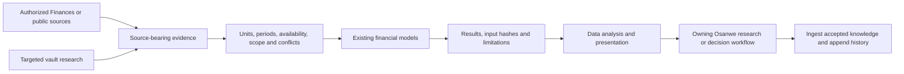

# Finance and Data integration

Finances supplies authorized account context. Osanwe supplies durable research,
financial semantics, calculations and decision discipline. Data supplies its
analysis and report/dashboard workflows. The integration is a checked handoff
over the existing engine; there is no second ontology, hidden account store or
automatic execution layer.

## Financial knowledge consumption

The foundation already exists: `wiki/meta/knowledge-moc.md` routes to the education
primers, Atlas method references and historical analyses. The context skill now
selects that foundation explicitly under `docs/financial-analysis-contract.md`.
Framework applicability, original-source review, unresolved conflicts, alternative
explanations and falsifiers accompany the checked numeric handoff into Data.
This is a consumption rule over the existing library, not a new retrieval engine.

Version 1.3.1 of the portable context carries those instructions and optionally
includes reusable public passages admitted by the existing document registry.
The default runtime-only package excludes those passages. A host without the
selected library must disclose the missing access; no ZIP or runtime receipt
proves that an entire original book was inspected.
The dated FINANCE-KNOWLEDGE-AUDIT-2026-09-12 report records the source inventory,
historical-text caveats, repaired challenge retrieval and verification limits.

The Opus 5 headless acceptance pass tightened the consumer boundary: a handoff
needs a concrete table/chart brief, exact evidence locations, display conversions
and missing-data behavior. Observed margin changes do not identify their causes;
sensitivities and falsifiers must match the evidence. The historical Microsoft
example now carries incremental-margin arithmetic through the existing operation
graph rather than leaving a narrative calculation outside the replay.
Named accounting identities bind same-period monetary inputs and exact output
labels, so total operating costs and separately reported operating expenses do
not collapse into one ambiguous subtraction. Adversarial tests reject role,
period, unit, basis and currency mismatches. The narrative review compares actual
prose and proposed next steps to receipt scope and every withheld reason.
OPUS5-FINANCE-ACCEPTANCE-2026-09-12.md records the baseline, corrections and
subsequent cases. These are bounded development tests with selected public or
synthetic context, not live account or full-harness certification.

## Current capability evidence

Current host-specific evidence is in HOST-CAPABILITIES-2026-09-13. The public
Microsoft FY2026 workflow exercised source retrieval, connected issuer facts,
deterministic and independent calculations, actual Data rendering, filter and
tooltip inspection, and offline export. Personal Finances access remains
unavailable in this task. The September 12 inventory below is preserved history.

Final report acceptance uses `workbench review` and `verify-review`, binding
source passages, original labels, obligations, method usage, reviewer coverage,
findings and actual delivered bytes. A changed chart, tooltip, source, scope or
method needs a new review. The existing seven-file calculation bundle remains
compatible; archive verification cannot certify changed code or live freshness.
`evidence.add_integration_draft` explicitly inserts new bridge claims as draft;
consumers must check status before treating ontology facts as validated.

FINANCE-DATA-CAPABILITIES-2026-09-12.json records the plugin service's actual
metadata and current tool discovery (prov: mcp:plugin_management dependency
metadata, 2026-09-12 09:54:47 UTC). Finances and Data are installed and enabled.
No Finances account tools are callable in this task, and no account read was
performed. Installed status is not authentication or workflow verification.
The local Finances manifest says its account app is required; dependency service
metadata marks its canonical self-reference optional. Preserve that discrepancy;
neither metadata field proves that the account connection works.

Data's installed skills and runtime support a local report consumer acceptance.
The dated mission report records its exact build and rendering outcome. The
portable context ZIP is prepared for the user's own supported host. It is not
automatically imported into ChatGPT and does not grant or synchronize app access.
OpenAI documents separate plugin installation and provider permissions in its
[plugin guidance](https://help.openai.com/en/articles/20001256/), and explains
context skills and analysis/report workflows in its
[Data guidance](https://help.openai.com/en/articles/20001518).

## One editing and calculation authority

| Responsibility | Owner |
|---|---|
| Context and workflow handoff | .agents/skills/finance-data/SKILL.md; generated Claude copy via sync.py |
| Versioned stateless packet | tools/fis/workbench.py; examples under the canonical skill's assets/ |
| Claim semantics and market capitalization | Existing tools/fis/evidence.py; market_cap accepts historical knowledge_cutoff |
| Operating valuation | Existing tools/fis/valuation.py; adapter verifies economic roles, full annual revenue, baseline timing/basis and forecast order |
| Exact cashflow classification | tools/fis/cashflow.py, pure in-memory API with minor-unit arithmetic |
| Durable lineage and fact history | Existing provenance.py and ontology.py with explicit destinations; no default writes from the bridge |
| Portable compilation | tools/package-finance-data.py and config/finance-data-plugin.json; exact source allowlist, no vault crawl |
| Report/dashboard presentation | Installed Data skill and shared runtime; evidence IDs and qualifiers survive the handoff |
| Continuing regression checks | checkall.py finance-data-tests plus existing evidence/institutional suites |

Full-workspace routing remains /invest, /portfolio, /networth, /brief, /market,
/backtest and /ingest. The context does not replace their procedures or judgment
gates. Household scenarios, bonds, tax lots, retirement, insurance, currency,
reconciliation, risk and optimization retain their existing numerical owners.
The portable package includes only the source-evidence, scalar, DCF and cashflow
subset; full-workspace capabilities are explicitly distinguished in the skill.

## Interchange and failure semantics

The `osanwe.analysis/1` packet declares classification, population/coverage,
report time, historical cutoff, sources, existing numeric claims, replayable
operations, gaps and conflict resolutions. The code rejects duplicate JSON keys,
duplicate identities, missing/cyclic dependencies, incompatible comparisons,
future/stale information, unsupported fields and nonfinite values.

Source conflicts remain inspectable. A recorded resolution names the complete
conflicting group, one selected value and a rationale; rejected values cannot
feed an operation. Availability is distinct from retrieval. Deterministic
results identify the requested report time; the CLI's write receipt records
actual execution time separately, without inventing a historical publication. Caller declarations still
require review: this tool cannot prove source truth, classification, disjoint
population membership or investment merit.

Operating DCF binding checks are semantic as well as numeric: cash cannot be
silently substituted for debt, quarterly or point revenue cannot be treated as
annual revenue, and a future cash forecast cannot replace a present balance.
Baseline balances/shares align with the annual period end. Baselines and every
forecast parameter share the declared nominal accounting basis; a real rate
requires an explicit conversion before admission.
The model still uses annual year-end projections and explicit assumptions; it
does not handle fractional first periods, banks, distress, NOLs or option value.

Cashflow uses signed exact integer minor units. Card payments are transfers,
refunds reduce expense, pending rows are excluded and disclosed, and unmatched
transfer legs retain their observable cash impact. A complete transaction view
does not prove a balance or net-worth change. Saving ratios are withheld when
the declared household population or classification is insufficient.

`run --outdir` validates/replays before creating a new directory, then emits
evidence/receipt/semantic JSON, source-bearing CSV, a report handoff and hashes.
`verify` compares the exact expected file set and bytes against fresh replay.
`diff` propagates input changes through the dependency graph without mutating
the existing store. Hashes detect changes; they are not signatures or source
authenticity certificates. A changed code revision also requires a new receipt.

## Privacy, portability and maintenance

The file workbench accepts reviewed public or synthetic packets; personal and
deidentified account packets are not a persistence escape hatch. Cashflow file
examples are synthetic only. Personal analysis must stay in an authorized host
that can keep records within that session, or within Finances with engine
execution explicitly unverified. Protected filesystem paths, traversal,
drive-relative ambiguity and alternate streams are refused. Source text is
data; CSV formula strings and Markdown cells are escaped before display.

The package compiler reads an exact curated list of context, runtime and
public/synthetic example files. It rejects linked/escaped inputs and verifies
the archive's exact regular-file closure and bytes. Source normalization affects
the generated copy only. No whole wiki, Calendar, account record, credential, app
manifest or permission configuration is included. Native discovery uses the
canonical workspace skill; imported copies require explicit regeneration and
host refresh after an update.

`tools/fis/capabilities.py` resolves read needs against exact trusted names in the
current session. Codex app and direct MCP registrations remain separate. The
September 13 observation exposed 30 applicable read bindings and exercised only
public company financials/filing reads; it established no personal account access.
See the dated financial-corpus connector receipts for exact scope and inputs.

The optional `--with-library` package mode reads the existing document registry's
`portable-context` manifest. It includes only exact approved authored passages
with hash-bound reuse rights, versioned source metadata and applicability limits.
It excludes original supporting excerpts, unreviewed inventory, adjacent text,
personal material and the host index. An empty eligible set refuses library
packaging; the existing runtime-only package remains available. Package verification
rechecks current admission and exact bytes, so a later source change invalidates
current eligibility without rewriting an old archive.

The model context stays small: select an owning workflow and only the needed
reference/packet. Data receives scoped tables, semantic definitions and lineage,
not the entire vault. Accepted findings return through /ingest and existing
append-only knowledge/history workflows. No new automatic monitor or scheduler
was enabled by this implementation.
